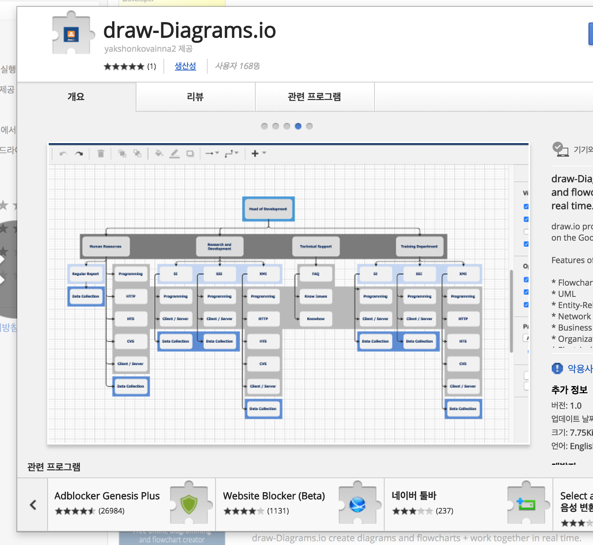

# 4회차 : 옵저버 패턴 적용해보기

프론트는 뷰가 있어서 자바,파이선이런데서 나온 객체지향 패턴을 똑같이 적용하기 힘듦.  
프론트에 최적화 된 패턴은 계속 발전중  

"의존성/결합도"를 관점으로 내 코드가 좋은지 안 좋은지 판단해라.  
패턴을 고정하지 말기.  
작은거 여러개보다 밀도있게 한 경험을 더 권장함 (이렇게 해봤는데, 이게 아쉬웠고, 이렇게 개선했다.) 


## 옵저버 패턴 Observer Pattern

**`기본 코드 구조`**  
```javascript
// 예)
class Observable {
  constructor() {
    this._observers = new Set();
  }
  subscribe(observer) {
    this._observers.add(observer);
  }
  unsubscribe(observer) {
    this._observers = [...this._observers].filter(subscriber => subscriber !== observer);
  }
  notify(data) {
    this._observers.forEach(observer => observer(data));
  }
}

//observable
const source$ = new Observable();

//구독 (subscribe)
source$.subscribe((data)=> {
  console.log(`movie is ${data}`);
});

//알림 (notify)
document.body.addEventListener("click", () => source$.notify("어벤져스 인피니티워"));
```

new Set() ==> [...this._observers]  
이터러블은 스프레드랑 for of를 쓸 수 있음.  
이터러블? (문자열을 배열처럼 돌릴 수 있는 이유)  
(내부 프로토타입에 Iterator가 있으면 가능)  


위의 코드처럼 할 수도 있지만 (배열처럼 순서대로 받기만)
맵핑관계를 만들어 줄 수도 있음  
핵심은 뭔가 등록해놓고, 돌면서 실행시키는거고 ==> 그 실체가 무엇인지는 관심이 없음  

이 코드가 표준은 아님. 그러나 유사할 것  
addEventListener도 옵저버패턴과 유사한 것   

<br>


**`구성요소`**  
* observable (또는 subject) : 구독 당하는 애. 여러 옵저버에 구독당할 수 있음 (like 신문사)
* observer : 구독하는 주체. 어떤 subject를 구독할 지 메서드로 결정 (일반적으로 subscribe, unsubscribe, notify 같은 기능을 가지고 있음) (like 구독자)
위 코드는 function을 받고 있는데, 객체를 받을 수도 있음  
객체를 받고 객체의 메서드를 실행하는데 이 메서드명은 약속기반으로 보통 만듦. (obj.update())  
  
**todo 코드**에서는...
뷰 이벤트 발생시, => 컨트롤러에서 `모델변경, 다른뷰변경` 하는 콜백같은 기능을 등록하는 부분을 (아래 기존코드)  
옵저버라는 별개의 객체를 만들어 관리하게 해주는 형식 => 의존성,결합도  
**등록하는 절차가 있다는 것을 드러내는 것이 더 좋음**  
모델 - 뷰 결합도를 낮추는 **또 다른 방법**
중간체를 놔두고 의존을 낮추는 방법  

```javascript
// 옵저버 적용할 부분
class TodoController {
  // ...
  handleClickCollapsedBtn() {
    this.model.toggleListStatus([
      this.toggleCollapsedBtnView.bind(this, this.model),
      this.toggleCollapsedListView.bind(this, this.model)
    ]);
  }
}
```

<br>

**`역할 이해하기`**

두개의 의존성을 서로 모르지만 (예상되는) 구조를 잡아줄 수 있음  

**데이터 어떻게 흐르는지, 의존성 어떻게 되는지 (객체지향의 (거의) 모든 것)**  

<br>

(공부하면서 기존에 써본 것과 유사하다고 생각 된 것)  
? mqtt  
? 이벤트 에미터 (노드에서하는거 / 커스텀 이벤트) 일종의 옵저버패턴이라 할 수 있음)  

<br>

**`데이터 흐름`**

ex) 슬라이드 컴포넌트  
슬라이드 동작 후 해야 할 일을 받아서 처리할 수 있는 컴포넌트라면...?  
AFTER_Slide: [ fn1, fn2, ... ]  간단히 구현한다면 이렇게 등록하여 사용하였음  

<br>

옵저버패턴은 이게 아니고,,, 이런 의견이 있을 수 있음?!
그러나 궁극적인 목적을 이해해야함 => 의존성을 낮아지게 하려고 만드는 것이다.
객체지향 왜? 의존성관리하기 때문.  
**의존성,결합도를 낮춤. ==> 유지보수 잘할 수 있습니다.!**  
**역할관계가 잘 정리되어 있음**   

<br>

그러나 작은 규모에서 쓸 필요없음


unidirection flow  (단방향)
무식하고 복잡해보일 수 있으나 
힘들지만 유지하는게 좋음.

<br>

( 리액티브 프로그래밍의 기본 )
- functional programming
- +observer pattern을 확장한 개념

(Rxjs참고)  
모든 객체가 옵저버블.체이닝으로 계속 이어감.비동기로 이어감  
리액트랑 상관없음  
데이터흐름을 모두 하나로 하자  
모든 언어에서 사용할 수 있지만, 자바스크립트랑 잘 어울림  
함수형 언어의 장점이 있다. 이벤트 비동기는 어떻게 할거냐? 이것마져 한방향으로 이어갈 수 있게 함.  

<br>

**`Todo에 observer를 어떻게 적용하지?`**

모델에서 사용해보기
상속 사용하기.

이렇게 바꾸게 되면?  
뷰는 순수한데 모델은 더러워짐 => observerble의 단점.(이런걸 말할 수 있어야)  
뷰에 한 줄도 수정이 없음 (코드를 잘 나눴으므로) 자주 바뀌는건 뷰이므로 뷰를 잘 분리해야 하는 것이 관건임  

뷰에서 직접 구독하고 그래도 됨. 컨트롤러 없이  
그러나 그런 구조에서는 뷰가 모델을 알아야 함  

기존코드보다 더 좋은거냐? 그렇지 않을 수 있음  
항상 의심하며 짜기.  

<br>

**`etc`**

? 비동기에 더 적합한 건가?  
콜백을 자를수 있으니까?  
-> 콜백지옥은 비동기에서만 일어나는 것

옵저버 subscribe 메서드  
모델과 컨트롤러간의 관계에서는 옵저버패턴 대부분 쓴다.  
구독/발행패턴(pub,sub) 은 옵저버 패턴을 응용한 것.  


--------

## 다시 이해해 봄 (todo코드에 적용하려고)

- A모델을 감시하는 대상이 여러 개 있다. (배열구조)
  - 여기서 모델이 Observable, 감시대상은 모델의 특정기능 동작시 호출할 fn들...
- 1개의 Observable이 여러 개의 감시자를 관리
  - Observable : Observer 는 1:n 관계. / 한 개의 주제를 여러 명이 구독함

<br>

## 적용과정

* 모델을 1개만 두고 todo app에서 관리하는 모든 데이터를 관리하도록 해놨는데
  * observer를 적용하려고 보니 적절치 않은 거 같아 todo모델과 list모델로 모델도 분리하기로 함


피드백

* ajax 두는게 항상 애매한 것이다. 컨트롤러에서? 모델에서? 뷰에서? 고민할 것.
* 컨트롤러는 구독정보 같은 것만 관리하도록 역활을 명확히 하는 방향이 좋을 것 같음


수정하고 싶은 부분

* 모델의 addTodo가 묘하게 겹침..ㅠㅠㅠ
* document.addEventListener('DOMContentLoaded', () => {를 컨트롤러 이닛하게 했는데
  * 컨트롤러는 돔로드와 상관없이 미리 돌아가도 되는애다.
  * 그래서 컨트롤러에서 뷰이닛을 담당하게 했는데, 그러니 뭔가 컨트롤러에 있는게 적절하지 않아보임.
  * 컨트롤러가 없으면 뷰는 자체 init을 못하는건가?
  * 또 한편으로는 한번에 이벤트 받아서 init시키고 싶은데 그러면 컨트롤러에서 해야하는데...


완성한 객체 구성

* observable 
* model (observable을 상속받음)
  * todo
  * list
* view
  * form
  * collapsed button
  * list
* controller


<br>

## todo코드에 적용해보고 느낀 점

* subscribe, unsubscribe, notify같은 메서드명을 사용하는 환경의 문맥에 맞게 변경해줘도 괜찮겠음  
  모델에서는 on, off, fire가 더 읽기 쉬워보여서 이름을 문맥에 적절히 바꿔주니 좋음
* 컨트롤러가 모델 변경시 어떤 콜백을 구독하는지 파악하기 어려워짐 (옵저버가 관리하게 되었기 때문에) / 대신 결합도가 낮아짐
* 결합도가 높고 복잡한 구조의 코드를 경험해보지 않아서 인지, 옵저버 패턴의 장점이 확 느껴지지 않음





